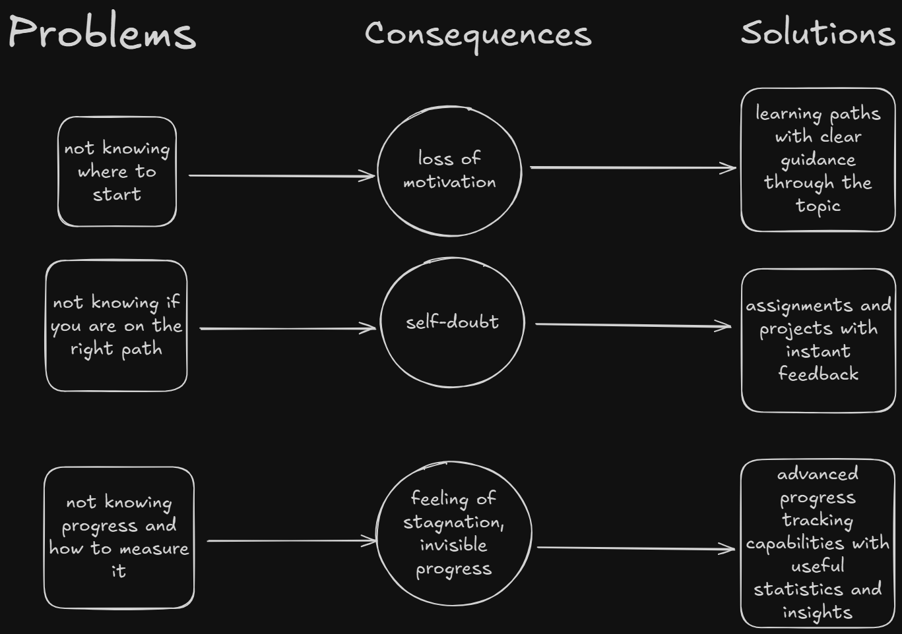
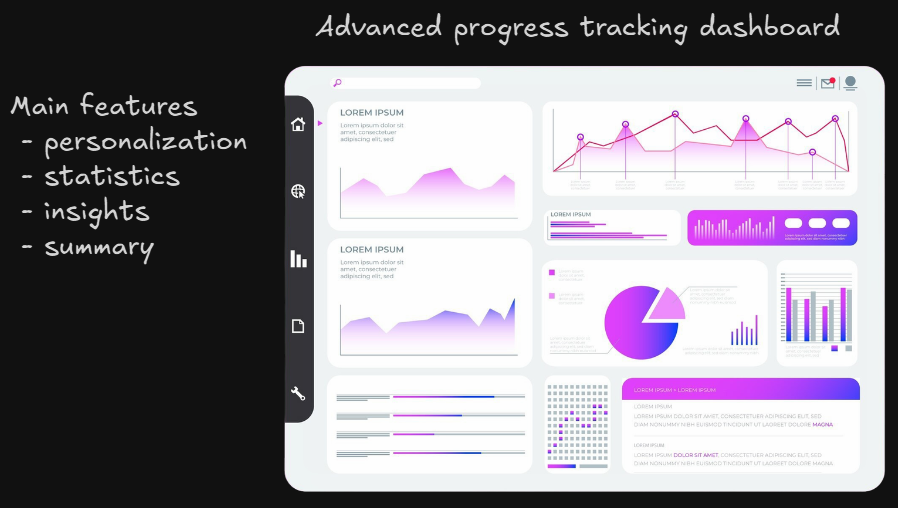

# Problems And How This Project Solves Them

The project aims to improve learning efficiency and satisfaction by tackling the following problems.

## Not Knowing Where To Start

Having too few resources leaves students lost. Having too many leaves them overwhelmed. The result is the same: motivation drops and learning stalls. Jumping from site to site or binge-watching tutorials leads straight into _tutorial hell_ — more time searching, less time learning.

Our solution is **structured learning paths** that combine the essentials: carefully chosen resources, practical exercises, and real projects. Each path is personalized, so every student can find a clear, confidence-building starting point.

## Uncertainty Whether You Are On The Right Path

It’s easy to wonder: _Am I learning the wrong way? Is there a better path I should be following?_  
This kind of self-doubt is paralyzing — instead of moving forward, students second-guess every step.

Our solution is **guided learning paths** with exercises and instant feedback. By testing skills along the way and offering clear insights, learners gain confidence that they’re heading in the right direction.

## Not Knowing Current Progress And How To Measure It

Learning without knowing where you stand is like walking in the dark — frustrating and demotivating.  
When progress is invisible, students feel lost and start questioning if their effort is even paying off.

Our solution is **advanced progress tracking** with detailed statistics and insights. Learners can clearly see what they’ve achieved, how far they’ve come, and what’s next. By making growth measurable and visible, the platform helps students stay motivated and confident in their journey.

# What This Project Is

This project is a learning platform designed to guide students step by step as they build new skills.  
It provides **structured learning paths** with clear guidance, and **advanced progress tracking** with meaningful statistics and insights.  
Instead of wandering through scattered resources, learners follow a clear path, measure their growth, and stay motivated.

# Core Features

## Progress Tracking

_<a href="http://www.freepik.com">Dashboard image designed by Freepik</a>_

Stay motivated with **advanced tracking tools** that go beyond a simple progress bar.  
Learners get access to a **customizable dashboard** that displays detailed statistics, highlights milestones, and provides clear insights into what’s been mastered and what comes next.  
With progress made visible and measurable, students can track their journey in a way that fits their own learning style.

## Tailored Learning Paths

No more guessing where to start or what to learn next.  
Each path is **structured and personalized**, combining resources, exercises, and projects that fit the learner’s needs while keeping progress consistent and rewarding.
