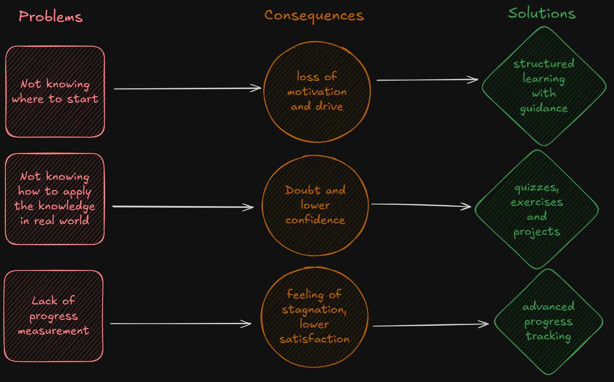
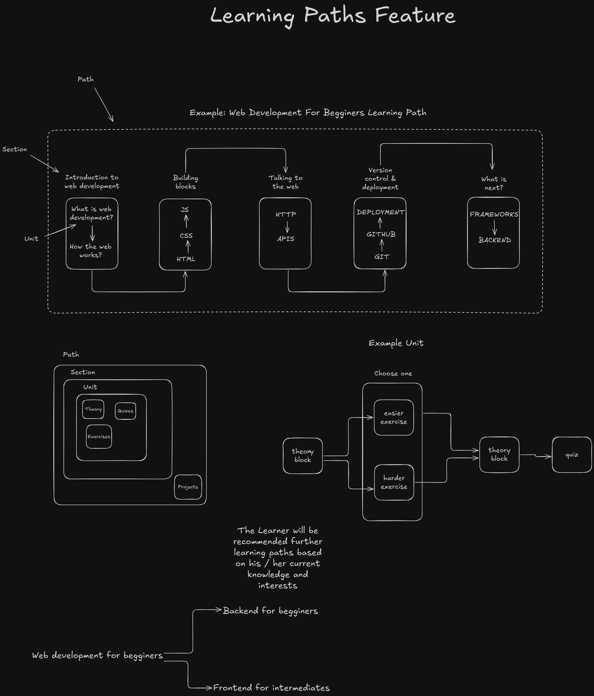

# What This Project Is

This project is a learning platform designed to guide learners step by step as they build new skills as well as the way for teachers and experts help them learn by creating structured learning paths.

It provides **structured learning paths** with clear guidance, **advanced progress tracking** with meaningful statistics and insights as well as **toolkit for creating learning paths** with the help of AI.

Instead of wandering through scattered resources, learners follow a clear path, measure their growth, stay motivated and experts get a way to help them achieve their educational goals.

# Who Is This Project For

This project is for learners who struggle with learning due to excess of resources, finding motivation or maintaining perseverance as well as for those who want to improve their learning quality and satisfaction by following clear learning path, receiving meaningful feedback along the way and having clear view of what they have learned, where they are and what is next. This project is also useful for teachers and experts who want to contribute to improving learning quality by creating structured learning paths.

## Learners

The project will have set of features particularly useful for learners in all education levels such as learning paths and progress tracking. These features will make learning easier and more satisfying by providing structure and clear overview of progress.

## Teachers And Experts

Teachers and experts will be able to create learning paths easier and faster with the assistance of ai.

# Problems And How This Project Solves Them

This project's goal is to **improve learning quality, efficiency and satisfaction** by tackling the most common problems learners face when learning.

## Not Knowing Where To Start

Having too few resources leaves learners lost. Having too many leaves them overwhelmed. The result is the same: motivation drops and learning stalls. Jumping from site to site or watching to many tutorials leads straight into **tutorial hell** (more time searching than actually learning).

Our solution are **learning paths** which include necessary **theory**, **practical exercises**, **quizes** and **projects**. Learning paths are focused on learning by doing, so learners not only learn the skill but also how to apply it in real-world domains.

## Doubt And Low Confidence

During the learning process doubt and drop of confidence can be an issue. Learners may start to wonder if they are going the right way or if they are learning correctly. This can negatively impact learning quality and experience by slowing down progress.

Our solution are **practical exercises**, **quizes** and **projects**. By testing skills and receiving feedback along the way, learners become confident in their skills and can use them in real world.

## Lack Of Progress Assessment Capabilities

Learning without knowing where you stand is like walking in the dark — frustrating and demotivating.
When progress is invisible, students feel lost and start questioning if their effort is even paying off.

Our solution is **advanced progress tracking** with detailed statistics and insights. Learners can clearly see **what they’ve learned**, **where they are**, and **what’s next**. By making growth measurable and visible, the platform helps students stay motivated and confident in their journey.

# Core Features

## Learning Paths

No more guessing where to start or what to learn next.  
Each path is **structured and personalized**, combining theory, exercises, quizes, and projects that fit the learner’s needs while keeping progress consistent and rewarding.

[More details about this feature](./docs/idea/features.md#learning-paths)

## Progress Tracking

_<a href="http://www.freepik.com">Dashboard image designed by Freepik</a>_

Stay motivated with **advanced tracking tools** that go beyond a simple progress bar.  
Learners get access to a **customizable dashboard** that displays detailed statistics, highlights milestones, and provides clear insights into what’s been mastered and what comes next.  
With progress made visible and measurable, students can track their journey in a way that fits their own learning style.

[More details about this feature](./docs/idea/features.md#progress-tracking)

## Toolkit For Creating Learning Paths With The Help Of AI

Support learners on all education levels by creating learning paths, which will help them learn faster, better and with confidence. Make education easier and more accessible by sharing your knowledge in a structured way.

[More details about this feature](./docs/idea/features.md#toolkit-for-creating-learning-paths)

# If You Are a Developer

If you are a developer, please make yourself familiar with [github strategy](./git.md) and [collaboration rules](./collaboration.md)

# Competitions

All information related to competitions is [here](./competitions/)
