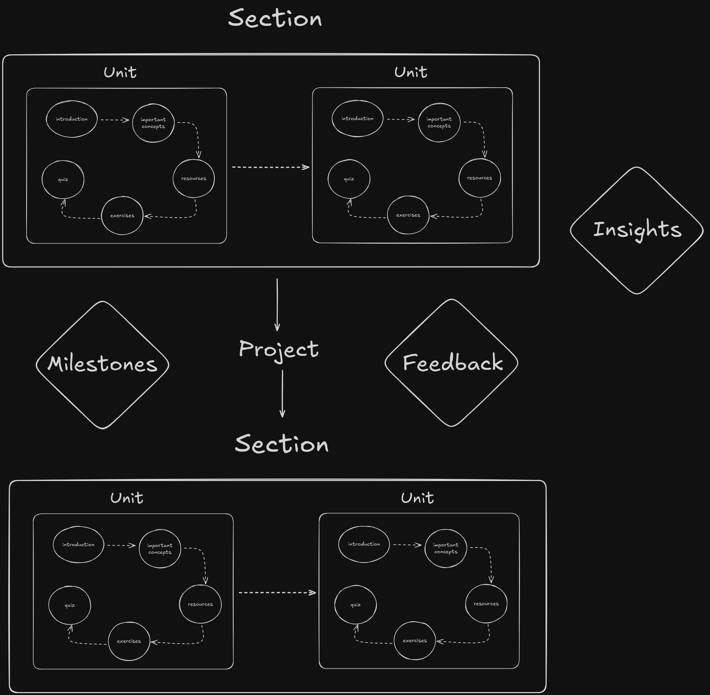

# Who Is This Project For

This project is for students and learners who want learn in a structured way with ability to measure their progress precisely as well as for teachers and field experts who want to contribute to creating structured learning experiences for learners and students all over the world.

## Learners

Learners in all education levels can use and will benefit from this project. They will be given access to features that will help them learn faster and better such as:

- learning paths,
- progress tracking

and even more in the future.

## Teachers And Field Experts

Teachers and field experts from all over the world will be able to help learners achieve their educational goals by creating structured learning paths, which will include necessary knowledge as well as tools to assess progress and test skills. They will be provided with:

- toolkit for creating such learning paths with the help of AI.

# Problems And How This Project Solves Them

The project aims to improve learning quality, perseverance and motivation by tackling the most common problems when it comes to learning.

## Not Knowing Where To Start

Having too few resources leaves learners lost. Having too many leaves them overwhelmed. The result is the same: motivation drops and learning stalls. Jumping from site to site or binge-watching tutorials leads straight into _tutorial hell_ — more time searching, less time learning.

Our solution is **structured learning paths** that combine the essentials: carefully chosen resources, practical exercises, and real projects. Each path is personalized, so every student can find a clear, confidence-building starting point.

## Doubt And Low Confidence

It’s easy to wonder: _Am I learning the wrong way? Is there a better path I should be following?_  
This kind of self-doubt is paralyzing — instead of moving forward, students second-guess every step.

Our solution are exercises, tests and projects. By assessing progress, testing skills, receiving feedback along the way and offering clear insights, learners gain confidence that they’re heading in the right direction and that they actually learned something.

## Lack Of Progress Assessment Capabilities

Learning without knowing where you stand is like walking in the dark — frustrating and demotivating.
When progress is invisible, students feel lost and start questioning if their effort is even paying off.

Our solution is **advanced progress tracking** with detailed statistics and insights. Learners can clearly see what they’ve achieved, how far they’ve come, and what’s next. By making growth measurable and visible, the platform helps students stay motivated and confident in their journey.

# What This Project Is

This project is a learning platform designed to guide students and learners step by step as they build new skills as well as the way for teachers and field experts help students and learners all over the world learn, by sharing and testing knowledge in a structured way.

It provides **structured learning paths** with clear guidance, **advanced progress tracking** with meaningful statistics and insights and **toolkit for creating learning paths** with the help of AI.

Instead of wandering through scattered resources, learners follow a clear path, measure their growth, and stay motivated and teachers and field experts get a way to help students and learnes achieve their educational goals.

# Core Features

## Learning Paths

No more guessing where to start or what to learn next.  
Each path is **structured and personalized**, combining theory, exercises, quizes, and projects that fit the learner’s needs while keeping progress consistent and rewarding.

[More details about this feature](./docs/idea/features.md#learning-paths)

## Progress Tracking

_<a href="http://www.freepik.com">Dashboard image designed by Freepik</a>_

Stay motivated with **advanced tracking tools** that go beyond a simple progress bar.  
Learners get access to a **customizable dashboard** that displays detailed statistics, highlights milestones, and provides clear insights into what’s been mastered and what comes next.  
With progress made visible and measurable, students can track their journey in a way that fits their own learning style.

[More details about this feature](./docs/idea/features.md#progress-tracking)

## Toolkit For Creating Learning Paths With The Help Of AI

Support learners on all education levels by creating learning paths, which will help them learn faster, better and with confidence. Make education easier and more accessible by sharing your knowledge in a structured way.

[More details about this feature](./docs/idea/features.md#toolkit-for-creating-learning-paths)

# If You Are a Developer

If you are a developer, please make yourself familiar with [github strategy](./git.md) and [collaboration rules](./collaboration.md)
