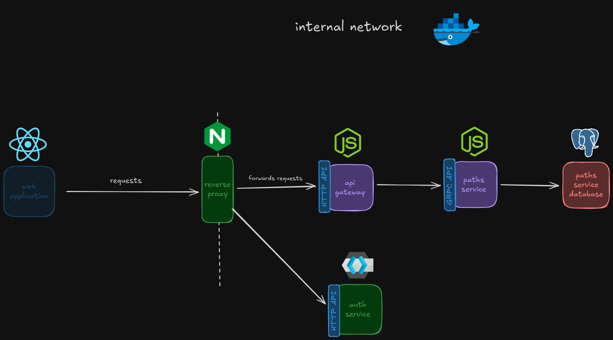

# Philosophy

Backend will consist of many internal and 3rd party services. Each internal service will have GRPC API with well defined contracts, so other services now how to communicate. There are also infrastructure services, which do not have a domain, instead they help with communication and security. Examples include auth service, load balancer or cache. Each internal service has it's own database which is only for that service.

# Request flow

Clients will not directly interact with internal services. Instead every request will go through reverse proxy, which will then forward requests to internal services.

# Overview

Diagram above represents current backend architecture. As we can see, clients does not interact with internal services directly, instead every request goes through reverse proxy which also takes care of load balancing. Api gateway exposes public HTTP API endpoints and contacts paths service. This additional layer exists, so paths service does not have to deal with caching, auth or infrastructure logic. Paths service has a database which is reserved only for it. If another service needs data about paths service it communicates with it using it's GRPC API. There is also 3rd party auth service (Keycloak), which takes care of users, authentication, authorization and is self-hosted.

# Motivation

Architecture was created with speed, security and SRP in mind. GRPC was chosen because of it's efficiency, bidirectional communication and contracts defined in language agnostic format (protocol buffers). Nginx was chosen because it's a battle-tested solution for load balancing and it is easy to setup with automatic HTTPS certificates. There is also api gateway service, which exposes HTTP endpoints, for all internal services. It takes care of caching and auth, so internal services can focus on their core domain (SRP).