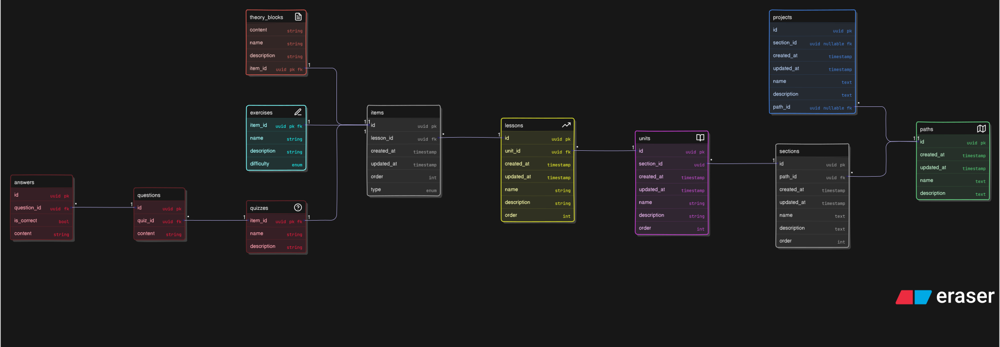

# Overview

Paths service exposes GRPC API, which allows for efficient and bidirectional communication. Contracts are defined [here](/backend//libs/contracts/proto/paths/). It also uses postgres as database, because it is popular and has many features and rich ecosystem.

# Database Design

**Note**: this is general design and does not include all database constraints. More details are defined as code using drizzle orm. You can see the exact tables [here](../src/infra/db/schemas/).

# Code

Code is written using concepts from Domain Driven Design and Clean Architecture. Those patterns were chosen because of scalability, readability and closeness to actual business domain.

**Note**: This is an architecture description, for code structure and convetions see [code.md](./code.md)

Service is defined into 3 layers:

- domain layer
- application layer
- infrastructure layer

## Domain Layer

Domain layer is the closest layer to the business. It contains domain entities, business invariants, core types enums and so on. It is important to understand that this layer does not contain any application logic, it is just business rules. This layer is independent of infrastructure and uses as few external libraries as possible. It mostly relies on language features.

## Application Layer

Application layer is responsible for application logic. It depends only on domain layer and composes logic from the rules defined there. This layer is also independent of infrastructure and uses as few external libraries as possible. To avoid coupling infrastructure with application layer dependency inversion technique is used by defining interfaces. For example if there is a class which needs to handle learning path creation and saving it to a data source it wouldn't contact database directly but rather call methods defined in repository interface. This interface would be implemented by concrete repository in infrastructure layer and contact the data source directly.

### Example

Let's say user wants to place order on a e-commerce platform. He has to add product to cart and pay for it. Next inventory state must be updated and product must be shipped. Also order confirmation email should be sent. This is a complex workflow which doesn't depend on concrete technologies. This logic is defined in application layer.

## Infrastructure Layer

Infrastructure layer is topmost layer. It depends on domain and application layers. This layer deals with sending response to the client, contacting external services and data source and it uses specific libraries or frameworks to achieve that.