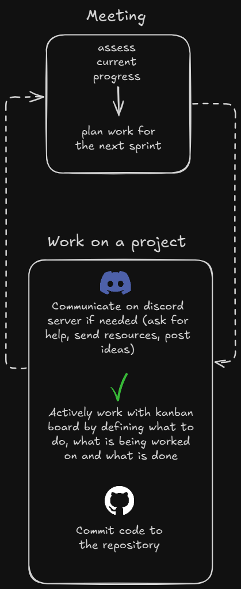

# Project Management Methodology

For this project **agile** methodology with simplified **kanban** framework is used. In other words, there is github project assigned to this repository with some boards. Every board contains 4 lists:

- To-Do (Things to be done),
- In-Progress (Things that are worked on),
- Done (Things that are done),
- Ideas (Ideas for future)

Each issue in repository is some kind of task to complete and will move through the lists in following order: **To-Do -> In-Progress -> Done**.

Agile means, that we want to develop software fast and quickly adapt to changes.

You can read more about agile, and kanban [here](https://www.atlassian.com/agile)

# How We Work

Every week (if neeeded) there is an online meeting, on which we asses current progress and plan work for next sprint (period beetwen meetings). All tasks to be completed are placed in a board in github and move through in the order mentioned above.

# Tools We Use

Although project is serious we are trying to use as little different tools as possible to keep everything clear and in one place. As for now, discord and github are used for communication and code respectively.

**Note**: We are not strictly following agile nor kanban. We are using some of theirs ideas to keep working on the project fun, engaging and avoid unnecessary bloat. Collaboration rules will evolve as the project grows to fit it's needs.

# Summary

Here is a helpful diagram that will help understand collaboration rules better.

