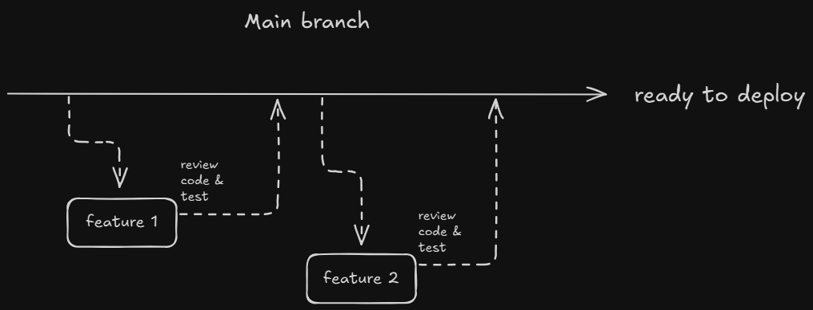

# Strategy

For working with git, github flow strategy will be used.
Github Flow involves working with main / master branch which will contain working, ready to deploy code, and multiple feature branches which will be branched off main and contain specific branches. After work on a specific feature is done code will be reviewed, tested and merged into main. After that feature branch will be deleted.

Here is a helpful diagram.

It is recommended that you read [this article](https://medium.com/@yanminthwin/understanding-github-flow-and-git-flow-957bc6e12220) to get comfortable with Github Flow
